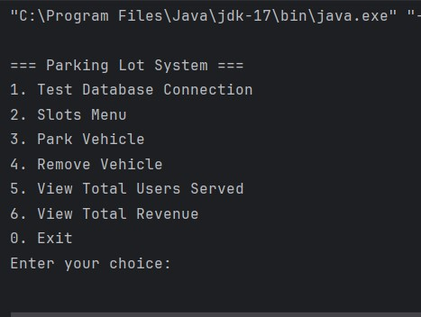
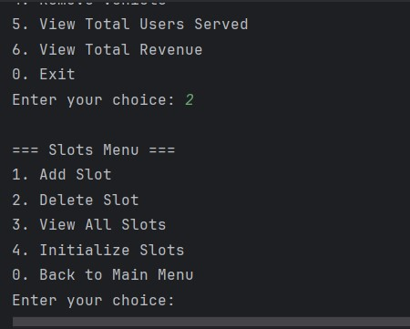
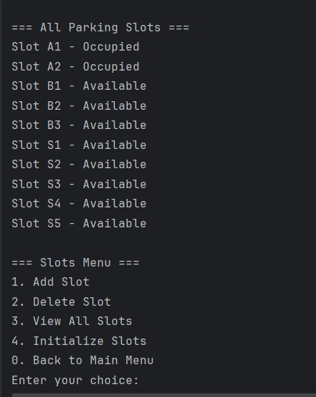
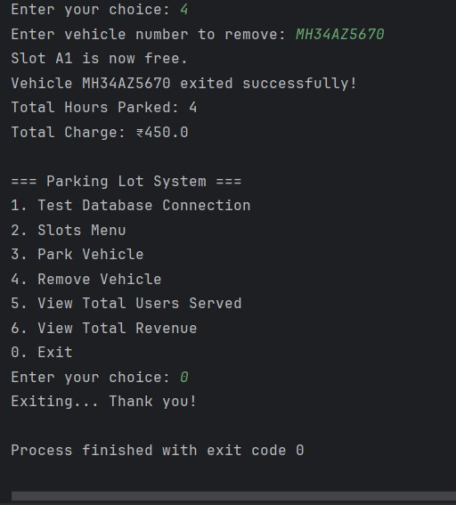
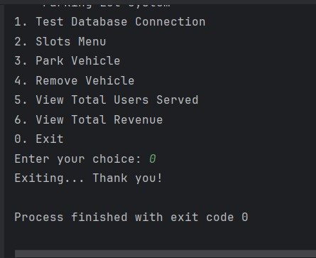

## Parking Lot System
A simple CLI-based parking lot management system written in Java. This system uses a MySQL database for persistence and provides functionalities like slot management, billing, and reporting.

### Technologies Used
- Java: Core language for developing the application logic.
- MySQL: For storing parking data, vehicles, and transactions.
- CLI (Command-Line Interface): Interactive user interface for operating the system.

### Prerequisites
- Java JDK 8 or higher installed
- MySQL Database: Ensure MySQL is set up and accessible. (I used Clever Cloud for SQL DB)

### Some Snapshots of the Application
- Main Menu
  
- Slots Menu
  
- Available Slots
  
- Vehicle Checkout
  
- Exit CLI
  

